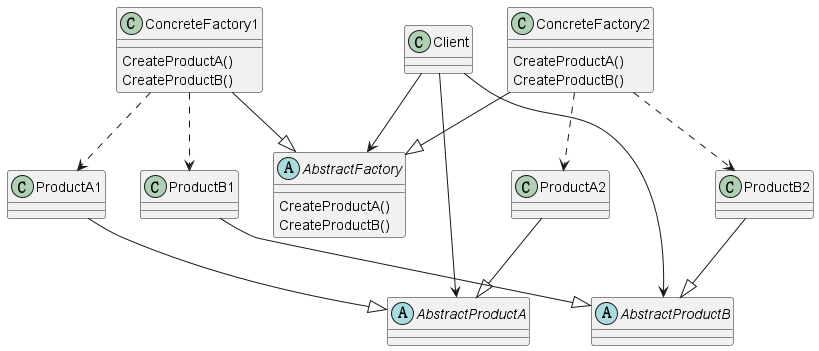

# 1 定义

Provide an interface for creating families of related or dependent objects without
specifying their concrete classes

提供一个可以创造有关系或者依赖关系族的接口而不指定特定的具体对象

# 2 结构

## 2.1 涉及成分

* AbstractFactory
  * 声明创造抽象产品对象的接口操作
* ConcreteFactory
  * 实现创造产品具体产品对象的操作
* AbstractProduct
  * 声明某个类型产品对象的接口
* ConcreteProduct
  * 定义被某个对应具体工厂创造的产品对象
  * 实现AbstractProduct接口
* Client
  * 只能使用在AbstractFactory和AbstractProduct中声明的接口

## 2.2 UML图

@startuml

abstract class AbstractFactory
{
    {method} CreateProductA()
    {method} CreateProductB()
}

class ConcreteFactory1
{
    {method} CreateProductA()
    {method} CreateProductB()
}

class ConcreteFactory2
{
    {method} CreateProductA()
    {method} CreateProductB()
}

class Client

abstract class AbstractProductA
class ProductA1
class ProductA2

abstract class AbstractProductB
class ProductB1
class ProductB2

ConcreteFactory1 --|> AbstractFactory
ConcreteFactory2 --|> AbstractFactory
ProductA1 --|> AbstractProductA
ProductA2 --|> AbstractProductA
ProductB1 --|> AbstractProductB
ProductB2 --|> AbstractProductB

ConcreteFactory1 ..> ProductA1
ConcreteFactory1 ..> ProductB1
ConcreteFactory2 ..> ProductA2
ConcreteFactory2 ..> ProductB2
Client --> AbstractFactory
Client --> AbstractProductA
Client --> AbstractProductB

@enduml

# 3 代码示例

