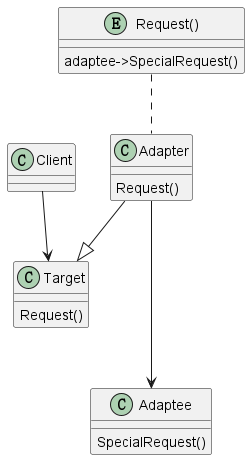

# 1 定义

Convert the interface of a class into another interface clients expect. Adapter lets
classes work together that couldn't otherwise because of incompatible interfaces.

将一个类的接口转换成客户端要求的另一个接口。适配器让因为接口不兼容的类可以一起使用。

# 2 结构

## 2.1 涉及成分

* Target
  * 定义特定情况的客户端使用的接口
* Client
  * 与符合目标接口的对象进行协作
* Adaptee
  * 定义已经存在的需要适配的接口
* Adapter
  * 将Adaptee的接口适配成Target的接口

## 2.2 UML图

@startuml

class Target
{
    {method} Request()
}

class Adapter
{
    {method} Request()
}

class Adaptee
{
    {method} SpecialRequest()
}

class Client

entity Request()
{
    adaptee->SpecialRequest()
}

Adapter --|> Target
Adapter ---> Adaptee
"Request()" .. Adapter
Client --> Target

@enduml

# 3 代码示例

