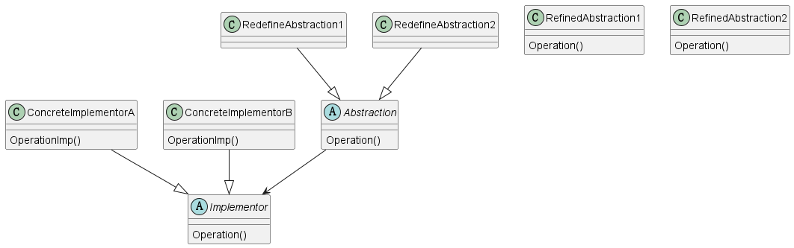

# 1 定义

Decouple an abstraction from its implementation so that the two can vary independently.

将抽象和具体实现解耦，这样他们可以保持独立性。

# 2 结构

## 2.1 涉及成分

* Abstraction(Window)
  * 定义Abstraction的接口
  * 包含一个Implementor类的对象引用
* RedefineAbstraction(IconWindow)
  * 扩展Abstraction定义的接口
* Implementor(WindowImp)
  * 定义实现接口的实现接口
* ConcreteImplementor(XWindowImp, RMWindowImp)
  * 实现Implementor的接口，定义具体的实现

## 2.2 UML图

@startuml

abstract class Abstraction
{
    {method} Operation()
}

class RefinedAbstraction1
{
    {method} Operation()
}

class RefinedAbstraction2
{
    {method} Operation()
}

abstract class Implementor
{
    {method} Operation()
}

class ConcreteImplementorA
{
    {method} OperationImp()
}

class ConcreteImplementorB
{
    {method} OperationImp()
}

RedefineAbstraction1 --|> Abstraction
RedefineAbstraction2 --|> Abstraction
ConcreteImplementorA --|> Implementor
ConcreteImplementorB --|> Implementor
Abstraction --> Implementor

@enduml

# 3 代码示例

