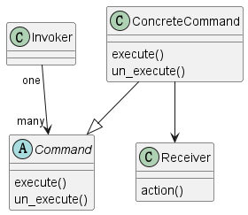

# 1 定义

Encapsulate a request as an object, thereby letting you parameterize clients with
different requests, queue or log requests, and support undoable operations.

将请求包装成一个对象，从而可以使得用不同的请求来参数化客户端，支持撤销操作。

# 2 结构

## 2.1 涉及成分

* Command
  * 声明执行操作的接口
* ConcreteCommand
  * 定义Receiver对象和动作之间的绑定
  * 通过Receiver对象的动作实现对应的操作
* Invoker
  * 要求命令执行请求
* Receiver
  * 知道如何执行与请求相关的操作

## 2.2 UML图

@startuml

class Invoker

abstract class Command
{
    {method} execute()
    {method} un_execute()
}

class ConcreteCommand
{
    {method} execute()
    {method} un_execute()
}

class Receiver
{
    {method} action()
}

Invoker "one"-->"many" Command
ConcreteCommand --|> Command
ConcreteCommand --> Receiver

@enduml

# 3 代码示例

