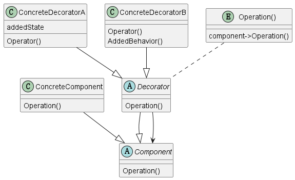

# 1 定义

Attach additional responsibilities to an object dynamically. Decorators provide a flexible alternative to subclassing for extending functionality.

为一个对象动态添加功能，装饰器为子类扩展功能提供了灵活的选择。

# 2 UML关系

## 2.1 简要描述

## 2.2 UML图

@startuml

abstract class Component
{
    {method} Operation()
}

class ConcreteComponent
{
    {method} Operation()
}

abstract class Decorator
{
    {method} Operation()
}

class ConcreteDecoratorA
{
    {method} Operator()
    {field} addedState
}

class ConcreteDecoratorB
{
{method} Operator()
{method} AddedBehavior()
}

entity Operation()
{
    component->Operation()
}

ConcreteComponent --|> Component
Decorator --|> Component
Decorator --> Component
ConcreteDecoratorA --|> Decorator
ConcreteDecoratorB --|> Decorator
"Operation()" .. Decorator

@enduml

# 3 代码示例

# 4 总结

## 4.1 使用场景

装饰器实际上就是在不改变某个对象本质的情况下，不断的添加一些新的装饰，让某个对象功能越来越复杂

## 4.2 代码实现技巧

实际上就是“has a " 和 "is a "之间的结合 

