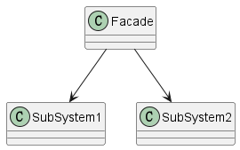

# 1 定义

Provide a unified interface to a set of interfaces in a subsystem. Facade defines a
higher-level interface that makes the subsystem easier to use.

为子系统中一系列接口提供一个统一的接口，Facade为了让自子系统更好使用定义了高层次的接口。

# 2 结构

## 2.1 涉及成分

* Facade(Compiler)
  * 知道各个子系统的功能
  * 将客户端请求委托给合适的子系统对象
* 子系统类（Scanner,Parser,ProgramNode,etc)
  * 实现子系统功能
  * 完成Facade对象委派的任务
  * 没有关于facade的引用

## 2.2 UML图

@startuml

class Facade

class SubSystem1

class SubSystem2

Facade --> SubSystem1
Facade --> SubSystem2

@enduml

# 3 代码示例

