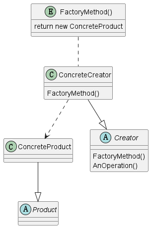

# 1 定义

Define an interface for creating an object, but let subclasses decide which class to 
instantiate. Factory Method lets a class defer instantiation to subclasses.

定义一个创造对象的接口，但是让子类决定实例化哪一个类。工厂方法将一个类实例化延迟到其子类，也称为虚拟构造。

# 2 结构

## 2.1 涉及成分

* Product
  * 定义工厂方法创造的接口
* ConcreteProduct
  * 实现Product的接口
* Creator
  * 声明工厂方法，返回一种类型Product的对象。
  * 可能会调用工厂方法创造Product对象
* ConcreteCreator
  * 重写工厂方法返回一个ConcreteProduct对象

## 2.2 UML图

@startuml
abstract class Product

class ConcreteProduct

abstract class Creator
{
  {method} FactoryMethod()
  {method} AnOperation()
}

class ConcreteCreator
{
  {method} FactoryMethod()
}

entity FactoryMethod()
{
  return new ConcreteProduct
}

ConcreteProduct --|> Product
ConcreteCreator --|> Creator
ConcreteCreator ..> ConcreteProduct
"FactoryMethod()" .. ConcreteCreator
@enduml

# 3 代码示例

