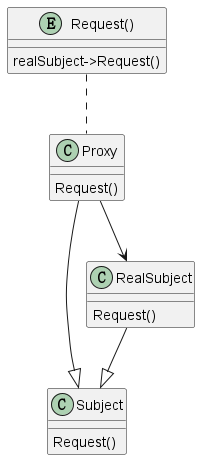

# 1 定义

Provide a surrogate or placeholder for another object to control access to it.

为另一个对象提供一个代理或者占位符去控制对它的访问。

# 2 结构

## 2.1 涉及成分

* Proxy(ImageProxy)
  * 维护一个可以访问真正对象的指针。Subject和RealSubject可能是同一个
  * 提供与Subject相同的接口，让代理可以替代真正的对象
  * 控制对真正的对象的访问，可能会负责创造和删除对象
  * 不同的代理可能有不同的功能
    * Remote Proxies:负责编码请求和相关参数发送到不同地方的真正对象
    * Virtual Proxies:可能会缓存额外的关于真正对象的信息，这样可以延迟访问。
    * Protection Proxies:检查调用者是否有访问权限
* Subject(Graphic)
  * 为RealSubject和Proxy定义共同的接口这样Proxy可以在需要RealSubject的地方使用
* RealSubject
  * 定义Proxy定义的真正对象

## 2.2 UML图

@startuml

class Subject
{
    {method} Request()
}

class RealSubject
{
   {method} Request()
}

class Proxy
{
    {method} Request()
}

entity Request()
{
    realSubject->Request()
}

RealSubject --|> Subject
Proxy --|> Subject
Proxy --> RealSubject
"Request()" .. Proxy

@enduml

# 3 代理示例

