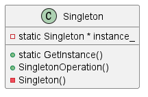

# 1 定义

Ensure a class only has one instance, and provide a global point of access to it.

保证一个类只有一个实例，提供对该实例的全局访问接口。

# 2 机构

## 2.1 涉及成分

* Singleton
  * 定义实例的访问接口
  * 可能负责创造唯一实例

## 2.2 UML图

@startuml

class Singleton
{
    {method} +static GetInstance()
    {method} +SingletonOperation()
    {field} -static Singleton * instance_
    {method} -Singleton()
}

@enduml

# 3 代码示例

