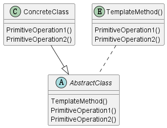

# 1 定义

Define the skeleton of an algorithm in an operation, deferring some steps to
subclasses.Template Method lets subclasses redefine certain steps of an algorithm
without changing the algorithm's structure.

在一个操作中定义一个算法的骨架，延迟一些具体操作到之类中。Template Method 让其子类可以重新定义算法的某些
步骤但是不需要改变算法的结构。

# 2 结构

## 2.1 涉及成分

* AbstractClass(Application)
  * 定义抽象的元操作，这些操作由具体的子类定义实现，构成算法的一些步骤
  * 实现 Template Method，这个方法定义了一个算法的骨架。Template Method调用在AbstractClass中定义的一些元操作
* ConcreteClass(MyApplication)
  * 实现元操作执行对应子类这个算法的具体实现

## 2.2 UML图

@startuml

abstract class AbstractClass
{
    {method} TemplateMethod()
    {method} PrimitiveOperation1()
    {method} PrimitiveOperation2()
}

class ConcreteClass
{
    {method} PrimitiveOperation1()
    {method} PrimitiveOperation2()
}

entity TemplateMethod()
{
    PrimitiveOperation1()
    PrimitiveOperation2()
}

ConcreteClass --|> AbstractClass
"TemplateMethod()" .. AbstractClass

@enduml

# 3 代码示例

[HeaderFile](../include/TemplateMethod.h)
[TestFile](../src/TemplateMethod.cpp)

# 4 总结

虚类中有算法的框架，依赖子类中的具体实现，不同的子类具体实现不一样，但是算法框架是一样的。

主要使用了“is a"，比较特殊的就是并不重写所有的方法，共同不变的方法不进行重写·